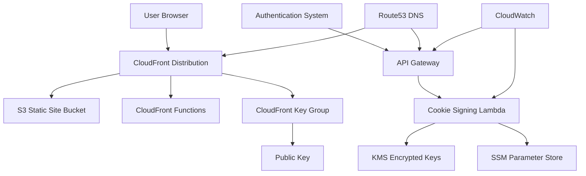

# Design Document

## Overview

WordPress Static Site Guardian is a comprehensive AWS solution that enables static WordPress sites to maintain authentication-protected content areas while leveraging the performance and security benefits of CloudFront CDN. The system uses CloudFront signed cookies for edge-based authentication, ensuring optimal performance and security.

The architecture consists of multiple AWS services working together: S3 for static hosting, CloudFront for global content delivery and authentication, API Gateway and Lambda for cookie management, and various supporting services for security, monitoring, and DNS management.

## Architecture

### High-Level Architecture



### Component Architecture

#### 1. Static Site Hosting Layer
- **S3 Bucket**: Hosts static WordPress-generated files with public access blocked
- **Origin Access Control (OAC)**: Provides secure access from CloudFront to S3
- **CloudFront Distribution**: Global CDN with custom domain and SSL certificate support

#### 2. Authentication and Authorization Layer
- **CloudFront Signed Cookies**: Edge-based authentication using RSA-SHA1 signatures
- **CloudFront Key Group**: Contains public keys for cookie verification
- **CloudFront Functions**: Edge-based request processing for authentication and path rewriting

#### 3. Cookie Management Layer
- **API Gateway**: REST API with custom domain for cookie issuance
- **Lambda Function**: Serverless cookie signing with native cryptography and KMS integration
- **KMS**: Secure private key encryption and management
- **SSM Parameter Store**: Encrypted private key storage

#### 4. DNS and Domain Management
- **Route53**: Automatic DNS record creation for custom domains
- **ACM Certificates**: SSL/TLS certificates for HTTPS enforcement

#### 5. Monitoring and Observability
- **CloudWatch Logs**: Comprehensive logging for all components
- **CloudWatch Dashboards**: Performance and authentication metrics
- **CloudWatch Alarms**: Proactive monitoring and alerting

## Components and Interfaces

### S3 Static Site Bucket

**Purpose**: Secure hosting of static WordPress-generated files

**Configuration**:
- Public access completely blocked
- Server-side encryption enabled (AES256)
- Versioning enabled for content management
- Bucket policy allows access only from CloudFront service principal

**Interface**:
- Input: Static WordPress files uploaded to `/{S3WWWRoot}/` prefix
- Output: Serves files to CloudFront distribution via OAC

### CloudFront Distribution

**Purpose**: Global content delivery with authentication-protected behaviors

**Configuration**:
- Custom domain with SSL certificate (TLS 1.2+)
- Origin Access Control for secure S3 access
- Multiple cache behaviors for public and protected content
- Custom error pages (404, 403)
- CloudFront Functions for request processing
- NoCachePolicy response policy for protected content cache control

**Cache Behaviors**:
1. **Default Behavior**: Public content, no authentication required
2. **Protected Path Behaviors**: Dynamically created for each protected path
   - Requires signed cookies via trusted key groups
   - Uses viewer-request functions for authentication checks
   - Uses NoCachePolicy response policy for strict cache control
3. **Restricted Path Behaviors**: Internal routing behaviors for authenticated content
   - Uses NoCachePolicy response policy to prevent caching of sensitive content

**Interface**:
- Input: HTTP/HTTPS requests from users
- Output: Static content or authentication redirects

### CloudFront Response Policy (NoCachePolicy)

**Purpose**: Strict cache control for protected and restricted content to prevent inappropriate caching of sensitive material

**Configuration**:
- Custom response policy named "NoCachePolicy"
- Sets "Cache-Control" header with "max-age=0" value
- Disables all other caching mechanisms
- Applied to all protected and restricted path cache behaviors

**Security Benefits**:
- Ensures sensitive content is never cached by browsers or intermediate proxies
- Forces fresh authentication checks on every request to protected content
- Prevents stale permission data from being served to users
- Maintains security even if user permissions change

**Interface**:
- Input: Responses from S3 origin for protected content
- Output: Modified responses with no-cache headers

### CloudFront Functions

**Purpose**: Edge-based request processing for authentication and path rewriting

#### Viewer Request Function (Authentication)
**Functionality**:
- Checks for valid signed cookies on protected paths
- Redirects unauthenticated users to sign-in page with return URL
- Rewrites authenticated requests to restricted path format
- Handles path normalization and index.html resolution

#### Path Rewrite Function (Origin Requests)
**Functionality**:
- Maps restricted paths back to original paths for S3 origin
- Handles S3 prefix mapping (adds `/{S3WWWRoot}/` prefix)
- Ensures proper file resolution for directory requests

**Interface**:
- Input: CloudFront request events
- Output: Modified request objects or redirect responses

### API Gateway

**Purpose**: RESTful endpoint for cookie issuance and management

**Configuration**:
- Custom domain (subdomain of main site)
- Regional endpoint with SSL certificate
- CORS support with credential handling
- AWS IAM authentication required

**Endpoints**:
- `GET /issue-cookie`: Issues signed cookies for authenticated users
- `OPTIONS /issue-cookie`: CORS preflight support

**Interface**:
- Input: IAM-signed HTTP requests
- Output: HTTP responses with Set-Cookie headers

### Lambda Function (Cookie Signing)

**Purpose**: Serverless cookie signing with secure key management and native cryptography

**Functionality**:
- Retrieves encrypted private key from KMS/SSM
- Uses Lambda runtime's native cryptography libraries for RSA-SHA1 signing
- Generates CloudFront signed cookies with proper expiration
- Handles both cookie issuance and expiration (sign-out)
- Comprehensive error handling and logging

**Environment Variables**:
- `DOMAIN_NAME`: Cookie domain scope
- `KEY_PAIR_ID`: CloudFront key pair identifier
- `COOKIE_EXPIRATION_DAYS`: Cookie lifetime configuration
- `PROTECTED_PATHS`: List of paths requiring authentication
- `KMS_KEY_ID`: KMS key for private key decryption

**Interface**:
- Input: API Gateway events with authentication context
- Output: HTTP responses with signed cookie headers

### CloudFront Resource Manager Lambda

**Purpose**: Custom CloudFormation resource handler for unsupported CloudFront resources

**Functionality**:
- Creates and manages CloudFront Public Keys
- Creates and manages CloudFront Key Groups
- Creates and manages Origin Access Control
- Creates and manages CloudFront Functions
- Creates and manages CloudFront Response Policies (NoCachePolicy)
- Handles CloudFormation lifecycle (Create, Update, Delete)
- Comprehensive error handling to prevent stack hanging

**Interface**:
- Input: CloudFormation custom resource events
- Output: CloudFormation responses with resource identifiers

### Key Management System

**Purpose**: Secure cryptographic key management

**Components**:
- **KMS Key**: Encrypts private keys with customer-managed key
- **SSM Parameter Store**: Stores encrypted private key securely
- **CloudFront Public Key**: Stores public key for cookie verification
- **CloudFront Key Group**: Groups public keys for distribution association

**Interface**:
- Input: RSA key pairs generated by key generation script
- Output: Secure key storage and retrieval for cookie operations

## Data Models

### CloudFront Signed Cookie Structure

```json
{
  "CloudFront-Policy": "base64-encoded-policy",
  "CloudFront-Signature": "base64-encoded-signature", 
  "CloudFront-Key-Pair-Id": "key-pair-identifier"
}
```

**Policy Document**:
```json
{
  "Statement": [{
    "Resource": "https://domain.com/protected-path/*",
    "Condition": {
      "DateLessThan": {
        "AWS:EpochTime": expiration-timestamp
      }
    }
  }]
}
```

### Configuration Parameters

```yaml
ProtectedPaths:
  Type: CommaDelimitedList
  Description: "Paths requiring authentication"
  Example: ["/dashboard", "/members", "/courses"]

CookieExpirationDays:
  Type: Number
  Description: "Cookie lifetime in days"
  Range: 1-365

DomainConfiguration:
  MainDomain: "example.com"
  ApiDomain: "api.example.com"
  CertificateArn: "arn:aws:acm:us-east-1:..."
```

### CloudFront Distribution Configuration

```yaml
Origins:
  - S3Origin: Static content from S3 bucket
  - SelfOrigin: Self-referencing origin for protected content routing

ResponsePolicies:
  - NoCachePolicy:
      Name: "NoCachePolicy"
      CustomHeaders:
        Cache-Control: "max-age=0"
      CachingDisabled: true

CacheBehaviors:
  - DefaultBehavior: Public content, no authentication
  - ProtectedBehaviors: Generated dynamically for each protected path
    - PathPattern: "/dashboard*", "/members*", etc.
    - TrustedKeyGroups: Reference to created key group
    - ViewerRequestFunction: Authentication function
    - ResponseHeadersPolicy: NoCachePolicy
  - RestrictedBehaviors: Internal routing for authenticated content
    - PathPattern: "/restricted/*"
    - ResponseHeadersPolicy: NoCachePolicy
```

## Error Handling

### CloudFormation Custom Resource Error Handling

**Strategy**: Comprehensive error handling to prevent stack operations from hanging

**Implementation**:
- Module-level validation on Lambda import
- Multiple layers of try/catch blocks
- Emergency response system for critical failures
- Timeout protection with graceful degradation
- Proper PhysicalResourceId management
- Delete operations always return SUCCESS to prevent stack deletion blocking

### API Gateway Error Handling

**HTTP Status Codes**:
- `200 OK`: Successful cookie issuance
- `400 Bad Request`: Invalid request parameters
- `401 Unauthorized`: Missing or invalid IAM authentication
- `403 Forbidden`: Insufficient permissions
- `500 Internal Server Error`: Lambda function errors

**CORS Error Handling**:
- Preflight OPTIONS requests handled separately
- Dynamic origin validation for security
- Proper error response headers for browser compatibility

### CloudFront Function Error Handling

**Authentication Failures**:
- Missing cookies: Redirect to sign-in page
- Invalid cookies: Redirect to sign-in page with error parameter
- Expired cookies: Redirect to sign-in page for re-authentication

**Path Processing Errors**:
- Invalid path patterns: Serve 404 error page
- Missing files: Serve custom 404 error page
- Access denied: Serve custom 403 error page

### Lambda Function Error Handling

**Key Management Errors**:
- KMS decryption failures: Log error and return 500
- SSM parameter retrieval failures: Retry with exponential backoff
- Invalid key format: Validate and return descriptive error

**Cookie Generation Errors**:
- Invalid expiration dates: Use default expiration
- Signature generation failures: Log error and return 500
- Domain validation errors: Return 400 with validation message

## Testing Strategy

### Unit Testing

**Lambda Functions**:
- Mock AWS SDK calls for isolated testing
- Test cookie generation with known inputs
- Validate error handling paths
- Test timeout and retry logic

**CloudFront Functions**:
- Test authentication logic with various cookie states
- Validate path rewriting for different URL patterns
- Test redirect generation with proper return URLs
- Verify S3 prefix handling

### Integration Testing

**End-to-End Authentication Flow**:
1. Deploy test stack with test parameters
2. Upload test static content to S3
3. Test public content access (should succeed)
4. Test protected content access without cookies (should redirect)
5. Call cookie issuance API with test credentials
6. Test protected content access with cookies (should succeed)
7. Test cookie expiration and cleanup

**API Gateway Testing**:
- Test CORS preflight requests
- Validate IAM authentication requirements
- Test error responses and status codes
- Verify custom domain functionality

### Performance Testing

**CloudFront Performance**:
- Measure cache hit rates for public content
- Test edge location performance for authentication
- Validate cookie processing overhead
- Monitor origin request patterns
- Verify NoCachePolicy prevents caching of protected content
- Test cache behavior differences between public and protected paths

**Lambda Performance**:
- Test cold start times for cookie signing
- Measure KMS decryption performance
- Validate concurrent request handling
- Monitor memory and timeout usage

### Security Testing

**Authentication Security**:
- Test cookie tampering detection
- Validate signature verification
- Test expired cookie handling
- Verify domain scope enforcement
- Validate NoCachePolicy prevents sensitive content caching
- Test cache control headers are properly applied to protected content

**Key Management Security**:
- Test KMS key access controls
- Validate SSM parameter encryption
- Test key rotation procedures
- Verify audit logging

### Deployment Testing

**CloudFormation Testing**:
- Test stack creation with various parameter combinations
- Validate stack updates and rollbacks
- Test stack deletion and resource cleanup
- Verify custom resource error handling

**Cross-Region Testing**:
- Test certificate requirements (us-east-1)
- Validate DNS propagation
- Test global CloudFront deployment
- Verify regional API Gateway functionality