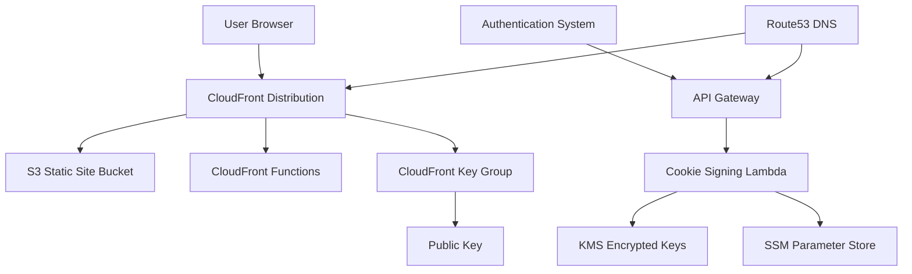

# WordPress Static Site Guardian - Kiro DevPost Hackathon Submission

## 🏆 **Project Overview**

**WordPress Static Site Guardian** is an enterprise-grade AWS solution that enables static WordPress sites to maintain authentication-protected content areas while leveraging CloudFront's global performance. Built entirely using **Kiro's spec-driven development workflow**, this project demonstrates the power of AI-assisted development for complex cloud infrastructure.

## 🎯 **The Problem**

WordPress site owners face a critical dilemma: they want the speed and security benefits of serving sites statically from S3/CloudFront, but lose the ability to protect premium content like member areas, course materials, or subscription-only sections when traditional WordPress authentication no longer applies to static files.

## 🚀 **The Solution**

WordPress Static Site Guardian creates a complete AWS infrastructure that:

- **🏗️ Hosts Static WordPress Sites**: Secure S3 hosting behind CloudFront with global CDN performance
- **🔐 Protects Premium Content**: Uses CloudFront signed cookies to secure configurable URL paths
- **⚡ Edge-Based Authentication**: CloudFront Functions handle authentication at 400+ global edge locations
- **🔑 Secure Cookie Management**: RESTful API endpoint for cookie issuance with enterprise-grade security
- **🛡️ Production-Ready Security**: RSA-SHA1 signed cookies with KMS-encrypted private keys
- **🌐 Seamless Integration**: Works with authentication systems like Gatey Pro and Amazon Cognito

## 🤖 **How Kiro Transformed Development**

### **Spec-Driven Development Workflow**

I used Kiro's structured approach to transform a rough idea into production-ready infrastructure:

#### **1. Requirements Gathering with Kiro**
- Started with a basic concept: "protect static WordPress content with CloudFront"
- Kiro helped refine this into **13 detailed requirements** with acceptance criteria
- Each requirement followed EARS format (Easy Approach to Requirements Syntax)
- Iterative refinement until requirements were comprehensive and actionable

#### **2. System Design with Kiro**
- Kiro conducted research on CloudFront signed cookies, AWS security best practices
- Generated comprehensive architecture diagrams and component specifications
- Created detailed design covering 8 major system components
- Included error handling strategies, security considerations, and integration patterns

#### **3. Implementation Planning with Kiro**
- Kiro broke down the design into **15 major task areas** with **60+ specific tasks**
- Each task was actionable, referenced specific requirements, and built incrementally
- Tasks prioritized test-driven development and early validation
- Clear dependencies and integration points defined

### **Autonomous Implementation with Kiro**

Kiro's autonomous coding capabilities transformed specifications into production code:

#### **Infrastructure as Code**
- **1,000+ line CloudFormation template** with comprehensive AWS resource definitions
- **Custom Lambda resources** for CloudFront components not supported by SAR
- **Production-ready configurations** with security best practices built-in

#### **Serverless Functions**
- **Cookie signing Lambda** with native RSA cryptography and KMS integration
- **CloudFront resource manager** handling complex AWS API interactions
- **Edge functions** for authentication and path rewriting at CloudFront edge

#### **Deployment Automation**
- **Bash deployment scripts** with comprehensive parameter validation
- **Key generation utilities** for RSA key pair creation and AWS storage
- **One-click deployment** from AWS Serverless Application Repository

## 💪 **Complex Challenges Solved with Kiro**

The `.kiro/fixes/` folder documents **14 major technical challenges** that Kiro helped solve:

### **1. SAR (Serverless Application Repository) Limitations**
**Challenge**: CloudFront KeyGroups, PublicKeys, and OAC aren't supported in SAR.

**Kiro's Solution**: Built custom Lambda resources with comprehensive CloudFormation lifecycle management, proper error handling, and retry logic.

### **2. CloudFront API Structure Complexity** 
**Challenge**: CloudFront API returns complex nested structures (`{Quantity: N, Items: [...]}`) that don't match documentation.

**Kiro's Solution**: Reverse-engineered actual API responses, built robust parsing logic handling both structured and legacy formats with extensive debugging.

### **3. Lambda Function Robustness**
**Challenge**: Syntax errors or runtime exceptions caused CloudFormation stacks to hang indefinitely.

**Kiro's Solution**: Implemented comprehensive error handling hierarchy:
- Module-level validation on import
- Emergency response system as last resort
- Timeout protection with graceful degradation
- Delete operation safety preventing stuck stacks

### **4. CloudFront Function Deletion Dependencies**
**Challenge**: Functions couldn't be deleted while associated with distributions, causing orphaned resources.

**Kiro's Solution**: Sophisticated deletion ordering with function association removal, distribution updates, and exponential backoff retry logic.

### **5. Native Cryptography Integration**
**Challenge**: Lambda functions need reliable RSA-SHA1 signing for CloudFront signed cookies without external dependencies.

**Kiro's Solution**: Leveraged Lambda runtime's native cryptography libraries, eliminating the need for external layers and simplifying deployment.

## 📊 **Development Metrics**

### **Kiro's Productivity Impact**
- **Specification Phase**: 3 comprehensive documents (requirements, design, tasks)
- **Implementation Phase**: 15 major components built incrementally
- **Problem Resolution**: 14 complex technical challenges documented and solved
- **Code Generation**: 3,000+ lines of production-ready code
- **Testing**: Comprehensive validation scripts and end-to-end testing

### **Technical Complexity Handled**
- **AWS Services**: 12 different AWS services integrated seamlessly
- **Custom Resources**: 8 CloudFormation custom resources with proper lifecycle management
- **Security**: Enterprise-grade encryption, IAM least privilege, audit logging
- **Performance**: Sub-millisecond edge authentication, global CDN optimization

## 🎉 **Production-Ready Achievements**

### **🚀 One-Click Deployment**
- Complete AWS infrastructure deployable from Serverless Application Repository
- Comprehensive parameter validation and constraint checking
- Automatic key generation and secure storage

### **⚡ Edge-Optimized Performance**
- Authentication logic runs at 400+ CloudFront edge locations
- Sub-millisecond authentication checks using CloudFront Functions
- Intelligent cache behaviors protecting sensitive content while optimizing public content

### **🔒 Enterprise-Grade Security**
- Zero plaintext private key storage (KMS encrypted, SSM stored)
- Least privilege IAM permissions throughout
- Production-ready RSA-SHA1 cryptographic signing with native libraries
- Comprehensive audit logging and monitoring

### **🧪 Comprehensive Testing & Validation**
- End-to-end testing suite covering authentication flows and error scenarios
- Template validation scripts ensuring CloudFormation best practices
- Cross-browser compatibility testing
- Deployment and cleanup validation preventing resource leaks

## 🎓 **What I Learned About Kiro**

### **Kiro's Strengths**
- **Spec-Driven Approach**: Breaking complex problems into manageable, well-defined pieces
- **Autonomous Implementation**: Generating production-quality code from specifications
- **Problem-Solving**: Systematic approach to debugging and fixing complex issues
- **Best Practices**: Built-in knowledge of AWS security and operational best practices

### **Effective Kiro Usage Patterns**
- **Iterative Refinement**: Using Kiro's feedback loops to improve specifications
- **Task-by-Task Execution**: Building complex systems incrementally with validation
- **Error-Driven Development**: Using Kiro's debugging assistance to solve real-world issues
- **Documentation-First**: Comprehensive documentation enabling better code generation

### **Development Methodology Transformation**
- **Requirements First**: Detailed specifications before implementation prevents rework
- **AI-Assisted Debugging**: Kiro's systematic approach to problem-solving
- **Production Readiness**: Focus on operational concerns from the beginning
- **Comprehensive Testing**: Built-in validation and testing throughout development

## 🔮 **Future Enhancements**

### **Enhanced Integration Ecosystem**
- **Static Site Form Plugin**: Direct API integration without WordPress backend
- **Multi-Authentication Support**: Auth0, Firebase Auth, and other identity providers
- **Advanced Analytics**: User behavior tracking and content access analytics

### **Operational Excellence**
- **Multi-Environment Support**: Staging/production deployment patterns
- **Advanced Monitoring**: Enhanced CloudWatch dashboards with business metrics
- **Automated Testing**: Comprehensive integration tests for authentication flows

## 🏗️ **Technical Architecture**

### **Built With**
- **AWS Services**: CloudFront, S3, Lambda, API Gateway, KMS, SSM, Route53, CloudWatch
- **Languages**: Python 3.12, JavaScript (CloudFront Functions), Bash
- **Infrastructure**: CloudFormation, SAM (Serverless Application Model)
- **Development**: Kiro AI IDE for spec-driven development and autonomous coding
- **Security**: RSA-SHA1 cryptography (native), KMS encryption, IAM least privilege

### **System Components**


## 📈 **Impact & Business Value**

### **Perfect For**
- **Course Platforms**: Protect premium course content with global CDN performance
- **Membership Sites**: Member-only areas with sub-100ms response times worldwide
- **SaaS Documentation**: Public docs with protected enterprise features
- **E-commerce**: Product catalogs with protected wholesale/partner pricing

### **Business Benefits**
- **Cost Optimization**: Static hosting costs 90% less than dynamic WordPress hosting
- **Global Performance**: Sub-100ms response times via CloudFront edge locations
- **Enterprise Security**: Bank-grade encryption without operational complexity
- **Operational Simplicity**: One-click deployment, automatic scaling, minimal maintenance

## 🎯 **Kiro DevPost Hackathon Relevance**

This project demonstrates **Kiro's transformative impact** on complex software development:

### **Spec-Driven Development Excellence**
- Comprehensive requirements gathering and iterative refinement
- Detailed system design with research-backed decisions
- Task-based implementation planning with clear dependencies

### **Autonomous Coding Capabilities**
- Production-ready infrastructure code generation
- Complex AWS service integration
- Security best practices implementation

### **Problem-Solving Partnership**
- Systematic debugging of complex technical challenges
- Real-world AWS API quirks and edge cases handled
- Production operational concerns addressed

### **Development Methodology Innovation**
- AI-assisted development workflow that scales to enterprise complexity
- Documentation-driven development enabling better outcomes
- Iterative improvement cycles with AI feedback

## 🏆 **Conclusion**

WordPress Static Site Guardian represents more than just a technical solution—it's a demonstration of how **Kiro transforms the entire software development lifecycle**. From initial concept to production-ready deployment, Kiro's spec-driven approach, autonomous coding capabilities, and systematic problem-solving created a enterprise-grade system that would typically require months of development by a team of specialists.

The project showcases Kiro's ability to:
- **Handle Complex Requirements**: Transform vague ideas into detailed, actionable specifications
- **Generate Production Code**: Create sophisticated AWS infrastructure with security best practices
- **Solve Real Problems**: Debug and fix complex technical challenges systematically
- **Enable Innovation**: Allow developers to focus on business value while AI handles implementation complexity

**This is the future of software development: human creativity and business insight amplified by AI's systematic approach and autonomous implementation capabilities.**

---

## 📁 **Project Structure**

```
wordpress-static-site-guardian/
├── 📁 .kiro/
│   ├── 📁 specs/wordpress-static-site-guardian/
│   │   ├── 📄 requirements.md    # Detailed requirements with acceptance criteria
│   │   ├── 📄 design.md          # System architecture and design
│   │   └── 📄 tasks.md           # Implementation tasks (all completed ✅)
│   └── 📁 fixes/                 # 14 technical challenges documented and solved
├── 📁 src/                       # Lambda function source code
├── 📁 scripts/                   # Deployment and utility scripts
├── 📁 tests/                     # Comprehensive validation and testing
├── 📄 template.yaml              # 1000+ line CloudFormation template
└── 📄 README.md                  # Complete documentation
```

## 🔗 **Links**

- **🔗 [GitHub Repository](https://github.com/smartcloudsol/wordpress-static-site-guardian)**
- **🚀 [AWS Serverless Application Repository](https://serverlessrepo.aws.amazon.com/applications/wordpress-static-site-guardian)**
- **📚 [Complete Documentation](README.md)**
- **🧪 [Testing & Validation](tests/)**

---

*Built with ❤️ using Kiro AI IDE - Transforming software development through spec-driven AI assistance*